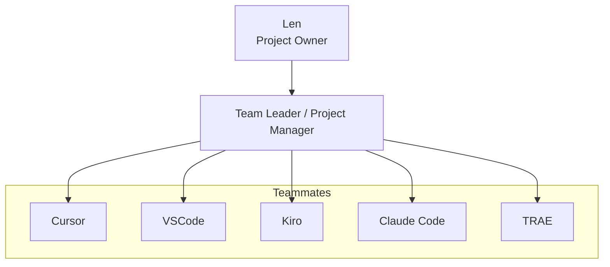

# Team Member Common Responsibilities

**Purpose:** Common responsibilities for team members (developers and tester) across projects.  
**Use:** Reference for all subordinates who execute tasks assigned by the Team Leader.

---

## Personnel Organization Chart

---

## Role Summary

| Role | Members | Primary Responsibility |
|------|---------|------------------------|
| Team Leader | Kiro | Plan, design, assign, supervise, review |
| Developer | Claude Code, VSCode, TRAE | Implement features, write code, fix bugs |
| Tester | Cursor | Write tests, run tests, validate quality |

---

## Core Mission

Execute assigned tasks to specification, deliver quality work, and report completion to the Team Leader. Team members implement and validate; the Team Leader plans and supervises.

---

## 1. Task Execution

- Read the **task prompt fully** before starting work
- Follow the architecture and design defined by the Team Leader
- **Clarify ambiguities** with the Team Leader before proceeding — do not guess
- Do **not** modify files outside the scope of the assigned task
- Do **not** overwrite or break work done by other team members
- Deliver work that meets the acceptance criteria in the task

---

## 2. Report Requirement (MANDATORY)

Every task assigned to any team member **MUST** result in a report file:

- **Location:** `{project}/tasks/`
- **Naming:** `YYYYMMDD-{task-id}-{task-name}-{executor}-rpt.md`
- **Required sections:**
  - **Status:** Completed / Partial / Blocked
  - **Files Created/Modified:** List with brief description
  - **Results:** What was implemented or validated, key decisions made
  - **Issues/Notes:** Problems encountered, deviations from spec, follow-up items

**No task is considered complete without a submitted report.**

---

## 3. Collaboration

- Report to the **Team Leader** — the Team Leader reports to Len (Project Owner)
- Ask the Team Leader for clarification when requirements are ambiguous
- Stay within the scope of the assigned task
- Coordinate implicitly via task files and reports — the Team Leader distributes work

---

## 4. Quality Standards

- Write clean, readable, maintainable code (developers) or thorough, meaningful tests (tester)
- Follow project conventions (file structure, naming, style)
- Handle edge cases and error conditions appropriately
- Document non-obvious logic with comments or docstrings

---

## 5. What Team Members Do NOT Do

- Assign tasks to other team members (Team Leader's responsibility)
- Make architectural or design decisions without Team Leader approval
- Modify task prompt files
- Mark a task complete without submitting a report

---

## Role-Specific Responsibilities

| Role | Key Activities | Detailed File |
|------|----------------|---------------|
| **Developer** | Implement features, fix bugs, write production code | `developer_responsibilities.md` |
| **Tester** | Write tests, run tests, validate quality, report bugs | `tester_responsibilities.md` |

---

## Performance Expectations

The Team Leader evaluates team member performance based on:

- Correctness and completeness of deliverables
- Adherence to task specifications
- Report quality and completeness
- Avoiding scope creep or unauthorized changes
- Speed and reliability of delivery

---

## Key Principles

1. **Execute, do not plan** — follow the task prompt; the Team Leader owns planning
2. **Report every task** — no exceptions; reports are mandatory
3. **Ask before guessing** — clarify ambiguities with the Team Leader
4. **Stay in scope** — do not modify files or areas outside the assigned task
5. **Quality over speed** — ensure correctness and maintainability

---

**Version:** 1.0  
**Last Updated:** 2026-02-23
